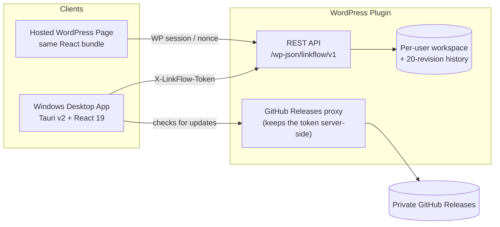

<div align="center">

# LinkFlow Dashboard

**A private, cross-platform link workspace.**
One account, one dataset, one interface — shared between a native Windows desktop app and an authenticated WordPress-hosted page.

[](./linkflow-dashboard/README.md)
[](./wordpress-plugin/linkflow-dashboard/README.md)
[](#)
[](#)
[](#)
[](#)

</div>

---

LinkFlow is a private link organizer — sections, collections, drag-to-sort, custom theming — plus a To-Do list and a timesheet with a Play/Pause/Stop clock, all synced to a single per-user cloud workspace. There are no public workspaces, no shared tabs, and no anonymous endpoints: every byte is scoped to an authenticated WordPress user.

## Why two clients, one app

The React interface is written once and runs in two places:

- **Windows desktop app** (Tauri v2) — the primary client. Signs in once with a WordPress username/password, then talks to the REST API directly over `X-LinkFlow-Token`. Never renders WordPress, the active theme, or Elementor.
- **Hosted WordPress page** — the same interface, dropped in via a `[linkflow_dashboard]` shortcode, authenticated by the visitor's own WordPress session. Useful as a recovery/device-switch path.

WordPress owns identity, per-user storage, sanitization, and revision history for both. See [`HANDOVER.md`](./HANDOVER.md) for the full architectural history and every lesson learned building it.

## Features

| | |
| --- | --- |
| **Link workspace** | Sections and collections, drag-to-sort onboarding wizard, bulk import, custom theming (font pairs + accent presets, fully tokenized — no hardcoded colors) |
| **To-Do list** | Grouped Today/This Week, optional priority flags and due dates |
| **Timesheet** | A real idle → running → paused → stopped clock (not just on/off), manual time entry, an activity prompt on stop, and a one-click Excel/email export of the day's sessions |
| **Floating timer widget** | An always-on-top, embossed Play/Pause/Stop button that floats over the desktop — click to start/resume/pause, hold 1.5s to stop |
| **System tray control** | The same three-state control from the notification area, including a real press-and-hold-to-stop gesture, with "minimize to tray" on window close |
| **Daily inspiration** | An optional quote or Bible-verse bubble, fetched and cached server-side — no client-side third-party calls |
| **Virtual pet** | An optional animated cat that wanders the dashboard and can be picked up and dropped — pure SVG, no image assets |
| **Auto-updates** | Signed releases via `@tauri-apps/plugin-updater`, proxied through the WordPress plugin so a private GitHub repo's releases stay reachable without exposing a token to the client |

## Architecture



Writes are debounced 800ms client-side, versioned server-side (`X-LinkFlow-Version`), and rejected with a 409 on a stale write — the desktop app is the authoritative, always-push client; the server is the recovery/device-switch path, not a live-sync backend.

## Current releases

| Component | Version | Status | Source |
| --- | ---: | --- | --- |
| Windows desktop app | **0.1.19** | Live (GitHub Release) | `linkflow-dashboard/src-tauri/` |
| WordPress plugin | **0.4.32** | Live on `controll.co.za` | `wordpress-plugin/linkflow-dashboard/` |

Each component keeps its own changelog — see their READMEs, linked below.

## Getting started

```powershell
cd linkflow-dashboard
npm install
npm run lint            # tsc --noEmit — the only "test" in this repo
npm run tauri:dev       # desktop dev shell
```

Build a signed Windows installer:

```powershell
npx tauri build --target x86_64-pc-windows-msvc
```

Package a WordPress release ZIP (from the workspace root):

```powershell
.\package.ps1
```

`package.ps1` bumps the plugin's patch version, rewrites it everywhere it needs to appear, builds the frontend assets, and writes a validated `dist/linkflow-dashboard-vX.Y.Z.zip` — see [`AGENTS.md`](./AGENTS.md) for the release contract it enforces.

## Documentation

| Doc | What's in it |
| --- | --- |
| [`HANDOVER.md`](./HANDOVER.md) | The full project history — every feature, every bug, every lesson learned, in detail |
| [`AGENTS.md`](./AGENTS.md) | Binding product/release rules (private-only, versioning discipline, deployment order) |
| [`linkflow-dashboard/README.md`](./linkflow-dashboard/README.md) | Desktop client changelog and architecture |
| [`wordpress-plugin/linkflow-dashboard/README.md`](./wordpress-plugin/linkflow-dashboard/README.md) | Plugin changelog, REST API, and workspace schema |
| [`block-elementor.md`](./block-elementor.md) | A project-agnostic guide to embedding any JS app inside a WordPress/Elementor page cleanly |

## Release discipline

Every release updates the applicable version declarations and documentation:

- `README.md` (this file)
- `linkflow-dashboard/README.md`
- `wordpress-plugin/linkflow-dashboard/README.md`
- `HANDOVER.md`
- `AGENTS.md`, when a product boundary or release process changes
- `block-elementor.md`, when a new general WordPress/Elementor-embedding lesson is learned

<div align="center">

Private repository — no public workspaces, shared tabs, or anonymous endpoints.

</div>
